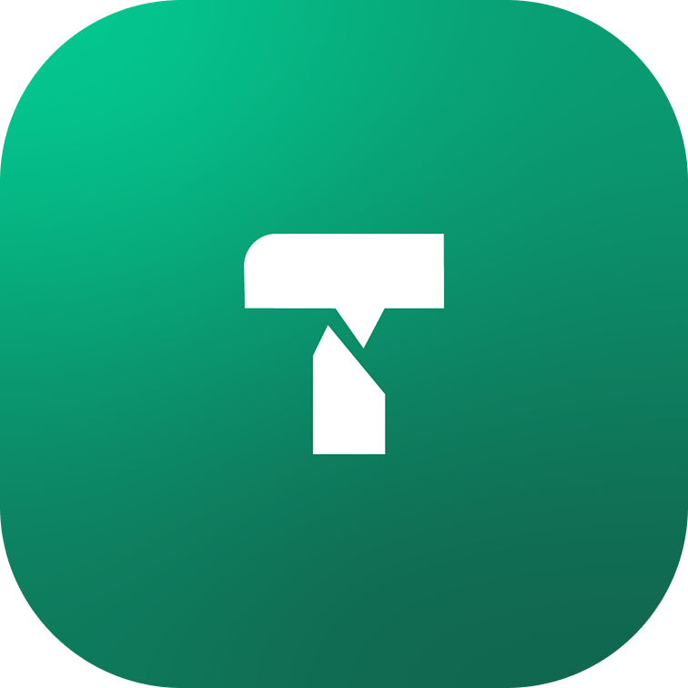

# Tarjam AI

  <h3>The #1 live AI translation app built for Masjids.</h3>
  
  
   
   
  

    Tarjam AI is a platform dedicated to providing real-time,
    live AI translations for Masjids around the world.
  

## Community

Stay connected with the Tarjam community! Follow our journey
as we bring translation to Masjids around the world. We share
updates about our platform, community highlights, and news all
over our Official Instagram and we are looking to create a
discord community soon.

<h3 align="left">
  
  
  
</h3>

## Other Questions & Concerns

If you have any other questions or concerns regarding our
platform, or if you are interested in bringing Tarjam to
your Masjid, please write to us at: [info@tarjam.ai](mailto:info@tarjam.ai).
